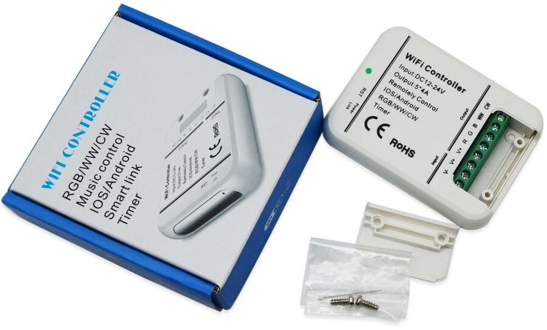

# MagicHome WiFi Controller
This is a bigger version of the [MagicHome LED Controller](../MagicHome_LED_Controller) often sold under the generic name "5CH WiFi LED Controller". Sometimes it's also sold under the "LEDENET" brand. 

I couldn't find very much information about it online so here is the pinout:

Pin    | Function
-------|------------------------------
GPIO14 | Red
GPIO12 | Green
GPIO13 | Blue
GPIO15 | WW
GPIO5  | CW
GPIO2  | Green Status LED (active low)
GPIO0  | Reset Button (active low)

To flash the controller the first time, you need to open it and solder some wires to power, RX and TX and connect them to a USB to serial adapter. You can use the onboard reset button to hold GPIO0 low to enter programming mode.  
After that you can upload any future updates via OTA.

