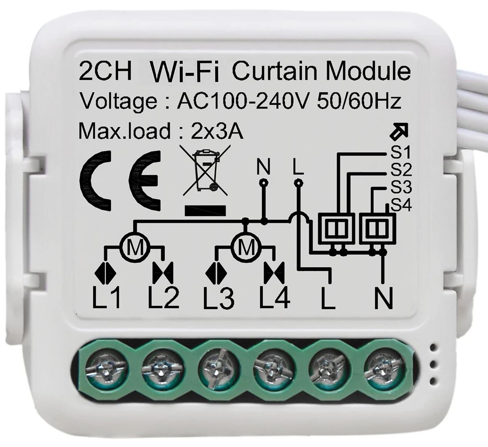
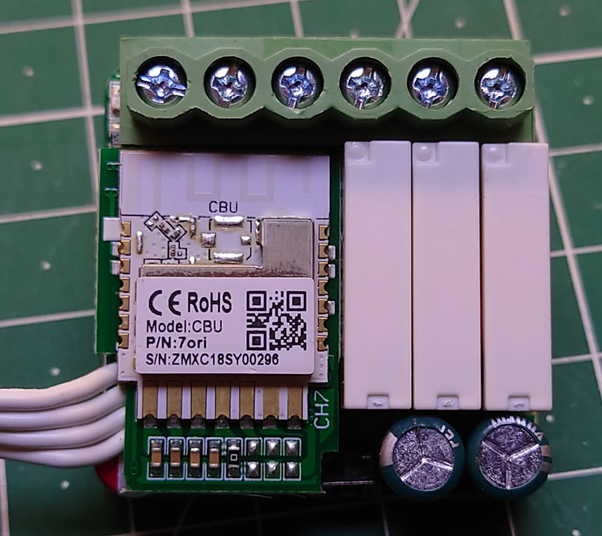
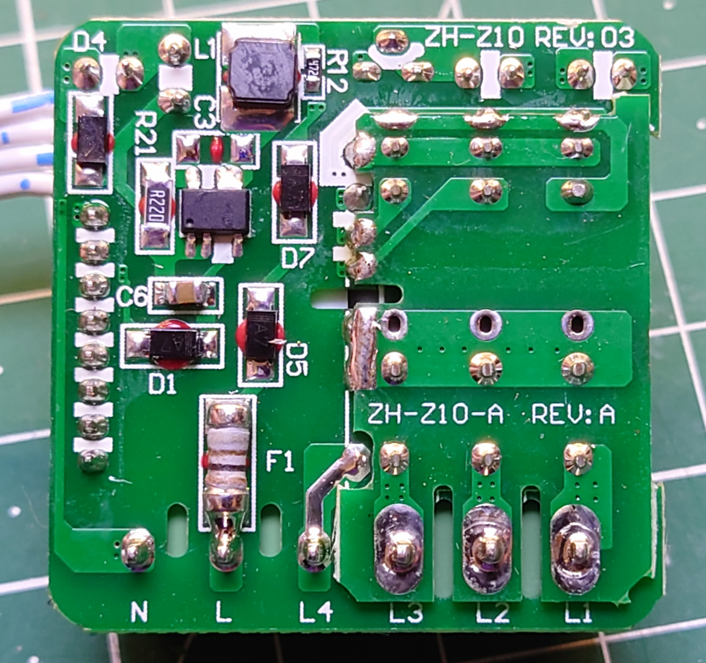
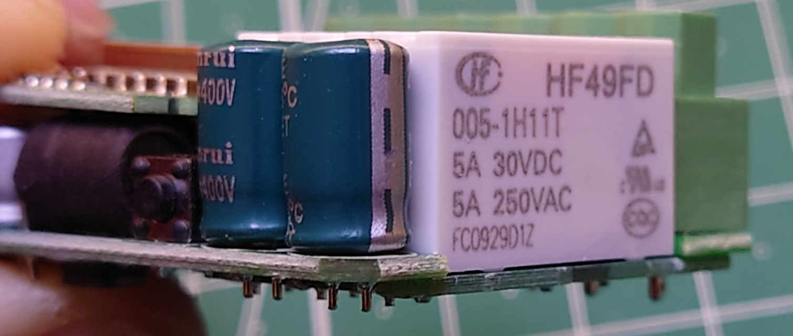
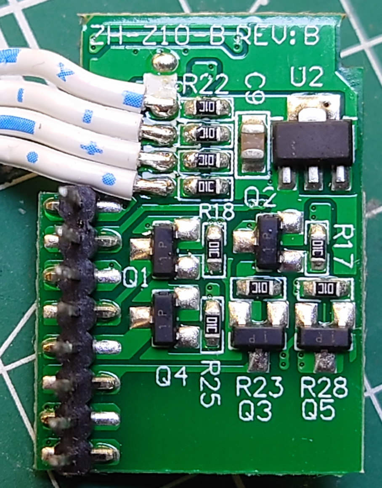
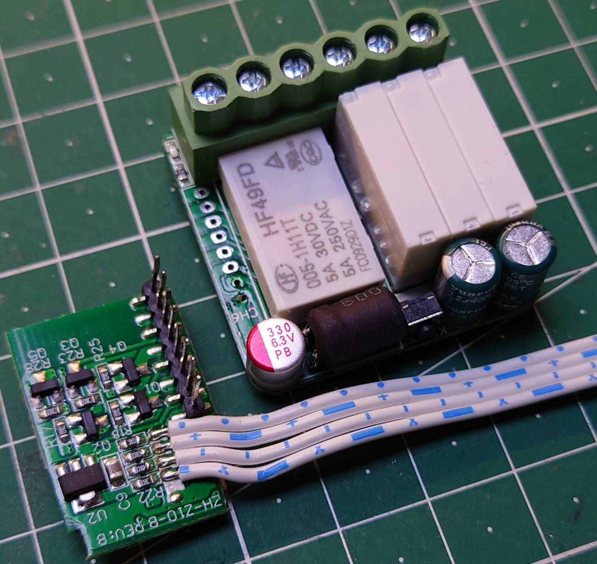

# Tuya GIRIER WiFi Dual Curtain Module

The included ESPHome yaml is currently intended for connecting curtain motors with integrated endstops that stop on their own.

There is surprisingly little information available about [those Tuya dual curtain modules](https://s.click.aliexpress.com/e/_DEKOhpr). Nobody seems to have tried to flash a custom firmware or documented the pinout.  
So I hope this buried README might find the right reader.

- It uses a Tuya CBU module (Beken BK7231N)
- [LibreTiny](https://docs.libretiny.eu/boards/generic-bk7231n-qfn32-tuya/) has support for the MCU, only the CBU module pinout documentation is currently just a [pull request](https://github.com/kuba2k2/libretiny/pull/106).
- Because of the Beken MCU instead of ESP8266/ESP32, you need to switch to / additionally install [LibreTiny ESPHome](https://github.com/libretiny-eu/esphome-hass-addon).
- Initial flashing can be done using `ltchiptool` (opening and soldering wires required) or `tuya-cloudcutter` (non-intrusive, but requires Linux laptop). More information about either flashing method [here](https://docs.libretiny.eu/docs/flashing/esphome/).
- The hardware is completely identical to the [Lonsonho Tuya _Zigbee_ Dual Curtain Module](https://s.click.aliexpress.com/e/_DEpmh5f), they've just changed the RF module.
- Idle power draw with WiFi connected: About 75mA @ 5V
- The label on the device is quite generic: "2CH Wi-Fi Curtain Module" and the listings sometimes talk about "1/2-Gang" instead of "dual".

## Pinout
Function                | GPIO                        | Notes
------------------------|-----------------------------|----------------------------------------------------------------------------------------------------------------------------------
LED                     | P9                          | Active high
Button                  | P26                         | Active low. Shared with S1
S1  S2  S3  S4 | P26  P6  P7  P8    | Inputs are directly connected to GPIO pins  There's only a 10k pull-up to 3.3V and a parallel capacitor for debouncing per pin
L1  L2  L3  L4 | P20  P28  P17  P16 | Relay outputs  NPN transistors are on the underside of the mezzanine board

### Mezzanine Pins
(from top to bottom, screw terminals oriented at the top)
1. LED
1. Relay L2
1. Relay L3
1. Relay L4
1. Relay L1
1. Button
1. Vcc (prob. 5V)
1. GND

## Images

  &nbsp;
  &nbsp;
  
  &nbsp;
  &nbsp;
  

